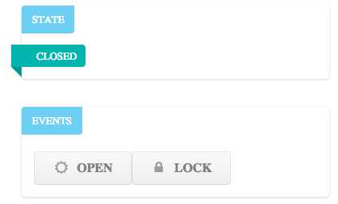
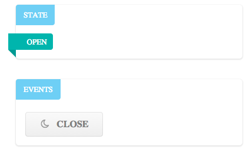

# React/RxJS Components

Using [React](http://facebook.github.io/react/) and [RxJS](https://github.com/Reactive-Extensions/RxJS) to build
reactive components.

React is used to implement ViewComponents, which are listening to logical ReactiveComponents.
The reactive components are built from behavior blocks using RxJs streams and the filter-scan-map combinator sequence.






Install [Browserify](http://browserify.org/) first, then build the project:

```
npm install
```
##Implementation Details

###Events
Events are published to a global event stream and filtered by each component. Example:

```
    handleEventClick: function(eventName) {
        this.publish({components: ['DoorEvents', 'DoorState'], event: eventName});
    }
```
###Global Event Stream
All component events are pushed to a global event stream.

```

    function EventStream() {

        var eventStream = new Rx.Subject();

        this.wire = function(viewComponent, logicalComponent, eventFilter) {
            return logicalComponent.getStateStream(eventFilter)
                .subscribe(viewComponent.setState.bind(viewComponent));
        };

        this.publish = function(event) {
            eventStream.onNext(event);
        };
    }
```

###Logical Components

Each logical component subscribes to events that is supposed to handle and publishes its state for consumption by one
or more view components.

Logical components are reactive systems. They are similar to objects in OO systems, but ehy are closer to the original
object vision: they maintain internal state that is mutated by events or messages that are sent to them without having
methods with various return types. The internal state is mapped to a public version that is published on a stream.

A logical component is similar to an Rx.Subject that is publishing only one type of event: the public state of the
component. This is similar to the ValueObject concept: http://martinfowler.com/bliki/ValueObject.html .

The implementation of the LogicalComponent mixin is straightforward:

```
    function LogicalComponent(eventStream, logic) {
        return {
            getStateStream: function (eventFilter) {
                return Rx.Observable.return(logic.publishedStateMapper(logic.initialState)).concat(
                    eventStream.filter(eventFilter)
                    .scan(logic.initialState, logic.eventProcessor)
                    .map(logic.publishedStateMapper))
            }
        }
    }
```

Example usage:

```

    var Stately = require('./Stately.js');

    var LogicalComponent = require('./logicalComponent');

    function DoorComponent() {

        var door = Stately.machine({
            'CLOSED': {
                'open': /* => */ 'OPEN',
                'lock': /* => */ 'LOCKED'
            },
            'OPEN': {
                'close': /* => */ 'CLOSED'
            },
            'LOCKED': {
                'unlock': /* => */ 'CLOSED',
                'break': /* => */ 'BROKEN'
            },
            'BROKEN': {
                'fix': /* => */ 'OPEN'
            }
        });


        return  {
            initialState: door.close(),
            eventProcessor: function (door, event) {
                console.log(door.getMachineState(), '->', event.event);
                return door[event.event]();
            },
            publishedStateMapper: function (door) {
                return {
                    'state': door.getMachineState(),
                    'events': door.getMachineEvents()
                }
            }
        }
    }

    module.exports = LogicalComponent(DoorComponent());
```

###View Components
View components are implemented using React. There is a ViewComponentMixin that implements the event related
functionality. Sample usage(doorEventsView.jsx):
                                
```

    var DoorEvents = React.createClass({

        mixins: [ ViewComponentMixin ],

        handleEventClick: function(eventName) {
            this.publish({components: ['DoorEvents', 'DoorState'], event: eventName});
        },

        cssMapping: {
            'close': 'moon',
            'open': 'sun',
            'lock': 'lock',
            'unlock': 'unlock',
            'break': 'settings',
            'fix': 'wrench'
        },

        render: function () {
            var links = this.state.events.map(function (event) {
                return <a className="action ui button" onClick={this.handleEventClick.bind(this, event)}><i className={this.cssMapping[event] + ' icon'}></i>{event}</a>;
            }, this);
            return(
                <div className="ui labeled vertical fluid icon">
                    {links}
                </div>
            );
        }
    });
```

Notice that all view related aspects are implemented in the view component, while the logical component is
view independent.

##Similar projects

https://github.com/logicalguess/rx-state-machine

https://github.com/kmcclosk/reactjs-rxjs-example