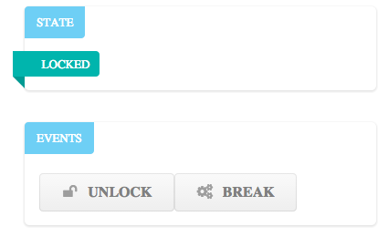
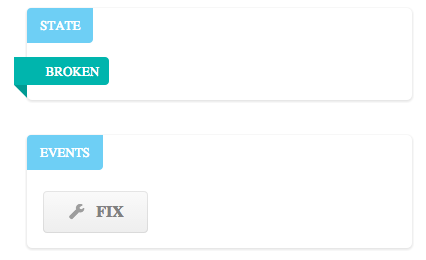

# React/RxJS Components

Using [React](http://facebook.github.io/react/) and [RxJS](https://github.com/Reactive-Extensions/RxJS) to build reactive components.

React is used to implement ViewComponents, which are listening to logical ReactiveComponents. The reactive components are built from
behavior blocks using RxJs streams and the filter-scan-map combinator sequence.






Install [Browserify](http://browserify.org/) first, then build the project:

```
npm install
```


                                
